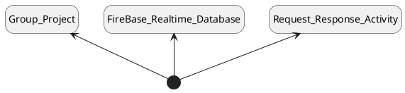

#[Insert Team Name Here]
#Project Structure

##Description

This is a UML diagram that shows the structure of our project. This is going to be a file that will get modified over time.

##API
This is the API that we will be using for our project:
[DND API](https://www.dnd5eapi.co/docs/#overview)

##Our Model

